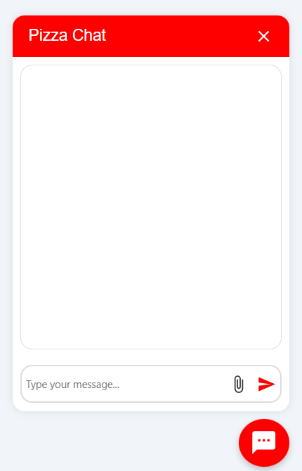

# Nomeda-TaskHub

<div align="center">
  
  <br>
  <p>
    <a href="https://github.com/YourUsername/Nomeda-TaskHub/issues">
      
    </a>
    <a href="https://github.com/YourUsername/Nomeda-TaskHub/pulls">
      
    </a>
    
    
    
    
  </p>
  <p><strong>A collaborative platform designed to streamline project management, team communication, and file sharing.</strong></p>
</div>

## 📋 Table of Contents

- [Overview](#overview)
- [✨ Features](#-features)
- [📸 Screenshots](#-screenshots)
- [🛠️ Tech Stack](#️-tech-stack)
- [📁 Project Structure](#-project-structure)
- [🚀 Getting Started](#-getting-started)
- [🔧 Environment Variables](#-environment-variables)
- [📚 API Documentation](#-api-documentation)
- [📝 Roadmap](#-roadmap)
- [🤝 Contributing](#-contributing)
- [📄 License](#-license)

## Overview

Nomeda-TaskHub is a comprehensive platform featuring real-time chat, task
tracking, authentication (including Google and GitHub), and a modern, responsive
UI designed for teams to collaborate efficiently.

## ✨ Features

- **Real-time Communication**

  - Chat messaging with instant notifications
  - File sharing in conversations
  - Read receipts and typing indicators

- **Project Management**

  - Kanban-style task boards
  - Task assignments and deadline tracking
  - Progress visualization and reporting

- **User Authentication**

  - JWT token-based authentication
  - OAuth integration (Google, GitHub)
  - Role-based access control

- **Dashboard & Analytics**

  - Project progress metrics
  - Team productivity insights
  - Custom reporting options

- **Additional Features**
  - Multi-language support (English, Spanish, Arabic)
  - Dark/Light theme options
  - Responsive design for mobile and desktop
  - File uploads with preview capabilities

## 📸 Screenshots

<div align="center">
  
  
  <br>
  
</div>

## 🛠️ Tech Stack

### Frontend

- **Framework**: React 18 with TypeScript
- **Build Tool**: Vite for fast development
- **State Management**: Context API
- **Styling**: CSS Modules / Styled Components
- **Internationalization**: i18next
- **APIs**: Fetch API, Socket.io client

### Backend

- **Runtime**: Node.js with Express
- **Language**: TypeScript
- **Database**: MongoDB with Mongoose ODM
- **Real-time**: Socket.IO
- **Authentication**: JWT, Passport.js (OAuth)
- **File Storage**: Local with multer (cloud storage ready)

### DevOps & Tools

- **Linting**: ESLint, Prettier
- **Version Control**: Git, GitHub
- **API Documentation**: Swagger/OpenAPI
- **Testing**: Jest, React Testing Library

## 📁 Project Structure

```
Nomeda-TaskHub/
├── backend/           # Node.js/Express API, Socket.IO, MongoDB models
│   ├── src/
│   │   ├── controllers/  # Request handlers
│   │   ├── middleware/   # Auth and validation middleware
│   │   ├── models/       # MongoDB schema definitions
│   │   ├── routes/       # API endpoint definitions
│   │   ├── sockets/      # Real-time communication logic
│   │   └── config/       # Environment configuration
│   └── uploads/          # Uploaded files (temporary storage)
│
├── Nomeda/            # React frontend (Vite, TypeScript)
│   ├── src/
│   │   ├── components/   # Reusable UI components
│   │   ├── pages/        # Application views/screens
│   │   ├── hooks/        # Custom React hooks
│   │   ├── context/      # Global state management
│   │   ├── assets/       # Images, icons, static files
│   │   └── locales/      # Translation files
│   └── public/           # Static assets served directly
└── README.md
```

## 🚀 Getting Started

### Prerequisites

- Node.js 16.x or later
- MongoDB 4.4+ running locally or MongoDB Atlas account
- npm or yarn package manager

### Backend Setup

1. Clone the repository

   ```bash
   git clone https://github.com/YourUsername/Nomeda-TaskHub.git
   cd Nomeda-TaskHub
   ```

2. Install dependencies

   ```bash
   cd backend
   npm install
   ```

3. Set up environment variables

   ```bash
   cp .env.example .env
   # Edit .env with your configuration
   ```

4. Start the development server
   ```bash
   npm run dev
   ```

### Frontend Setup

1. Install dependencies

   ```bash
   cd Nomeda
   npm install
   ```

2. Set up environment variables

   ```bash
   cp .env.example .env
   # Edit .env with your configuration
   ```

3. Start the development server

   ```bash
   npm run dev
   ```

4. Build for production
   ```bash
   npm run build
   ```

## 🔧 Environment Variables

### Backend (.env)

```
NODE_ENV=development
PORT=3000
MONGODB_URI=mongodb://localhost:27017/nomeda-taskhub
JWT_SECRET=your_jwt_secret_key
JWT_EXPIRES_IN=7d
GOOGLE_CLIENT_ID=your_google_client_id
GOOGLE_CLIENT_SECRET=your_google_client_secret
GITHUB_CLIENT_ID=your_github_client_id
GITHUB_CLIENT_SECRET=your_github_client_secret
UPLOAD_DIR=./uploads
```

### Frontend (.env)

```
VITE_API_URL=http://localhost:3000/api
VITE_SOCKET_URL=http://localhost:3000
VITE_GOOGLE_CLIENT_ID=your_google_client_id
```

## 📚 API Documentation

### Authentication

- `POST /api/auth/register` - Register new user
- `POST /api/auth/login` - User login
- `GET /api/auth/google` - Google OAuth login
- `GET /api/auth/github` - GitHub OAuth login
- `GET /api/auth/profile` - Get current user profile

### Projects

- `GET /api/projects` - Get all projects
- `POST /api/projects` - Create new project
- `GET /api/projects/:id` - Get project details
- `PUT /api/projects/:id` - Update project
- `DELETE /api/projects/:id` - Delete project

### Tasks

- `GET /api/projects/:id/tasks` - Get tasks for project
- `POST /api/projects/:id/tasks` - Create new task
- `PUT /api/tasks/:id` - Update task
- `DELETE /api/tasks/:id` - Delete task

### Chat

- `GET /api/chats` - Get user's chat list
- `POST /api/chats` - Create new chat
- `GET /api/chats/:id/messages` - Get messages in chat
- `POST /api/chats/:id/messages` - Send message to chat

### Files

- `POST /api/upload` - Upload file
- `GET /api/files/:id` - Download file

## 📝 Roadmap

- [ ] **Q3 2025**

  - Mobile application (React Native)
  - Calendar integration
  - Advanced analytics dashboard

- [ ] **Q4 2025**

  - AI-powered task recommendations
  - Workflow automation tools
  - Time tracking features

- [ ] **Q1 2026**
  - Extended API for third-party integrations
  - Custom plugin system
  - Enterprise-grade security features

## 🤝 Contributing

We welcome contributions to Nomeda-TaskHub! Here's how you can help:

1. Fork the repository
2. Create your feature branch (`git checkout -b feature/amazing-feature`)
3. Commit your changes (`git commit -m 'Add some amazing feature'`)
4. Push to the branch (`git push origin feature/amazing-feature`)
5. Open a Pull Request

Please make sure to update tests as appropriate and adhere to our code of
conduct.

## 📄 License

This project is licensed under the MIT License - see the [LICENSE](LICENSE) file
for details.
